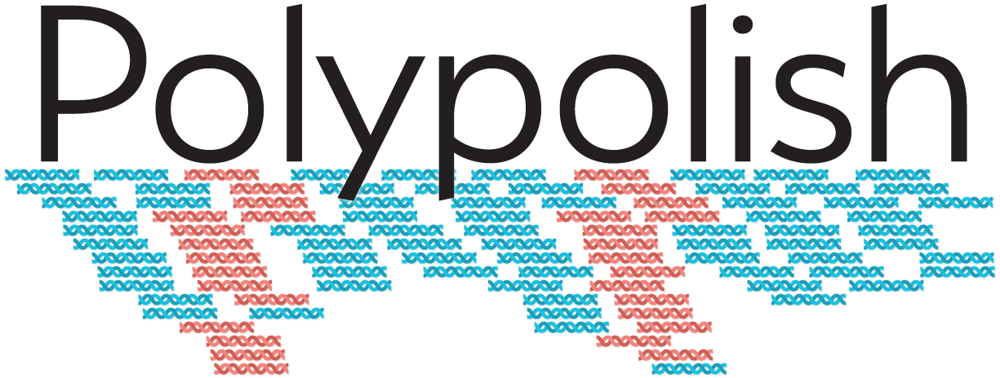

Polypolish is a tool for polishing genome assemblies with short reads. Unlike other tools in this category, Polypolish uses SAM files where each read has been aligned to _all_ possible locations (not just a single best location). This allows it to repair errors in repeat regions that other alignment-based polishers cannot fix.

For installation instructions, usage, deeper explanations and more, head over to the [Polypolish wiki](https://github.com/rrwick/Polypolish/wiki)!

**NOTE: this branch of the repo (`python`) is for the older Python-based implementation of Polypolish, the last version of which was v0.3.2. Since v0.4.0, Polypolish has been implemented in Rust, and you can find this version on the `main` branch.**

