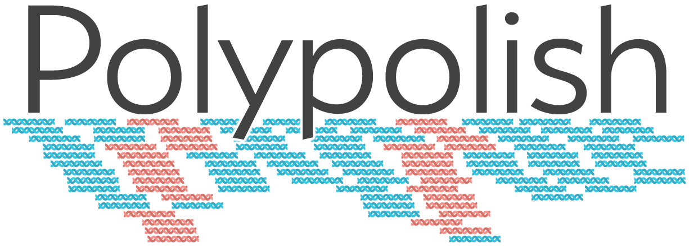

Polypolish is a tool for polishing genome assemblies with short reads. Unlike other tools in this category, Polypolish uses SAM files where each read has been aligned to _all_ possible locations (not just a single best location). This allows it to repair errors in repeat regions that other alignment-based polishers cannot fix.

For installation instructions, usage, deeper explanations and more, head over to the [Polypolish wiki](https://github.com/rrwick/Polypolish/wiki)!

For our paper describing Polypolish, follow this link: [Wick RR, Holt KE. Polypolish: short-read polishing of long-read bacterial genome assemblies. PLOS Computational Biology. 2022. doi:10.1371/journal.pcbi.1009802.](https://doi.org/10.1371/journal.pcbi.1009802)

 
